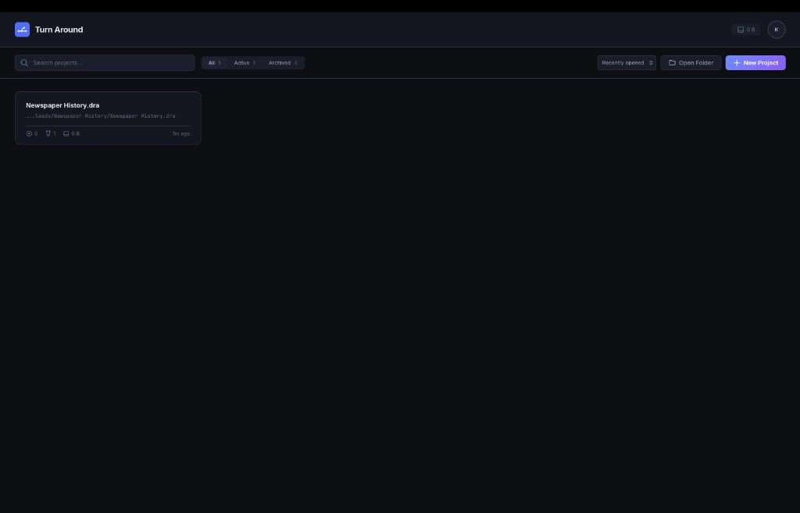
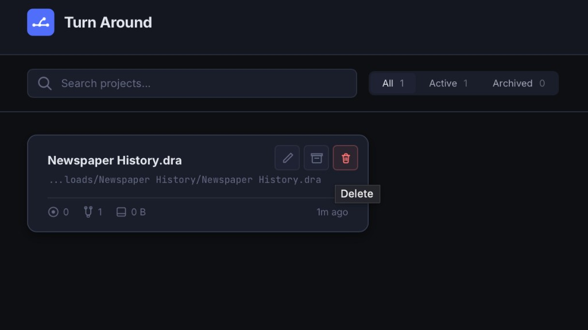
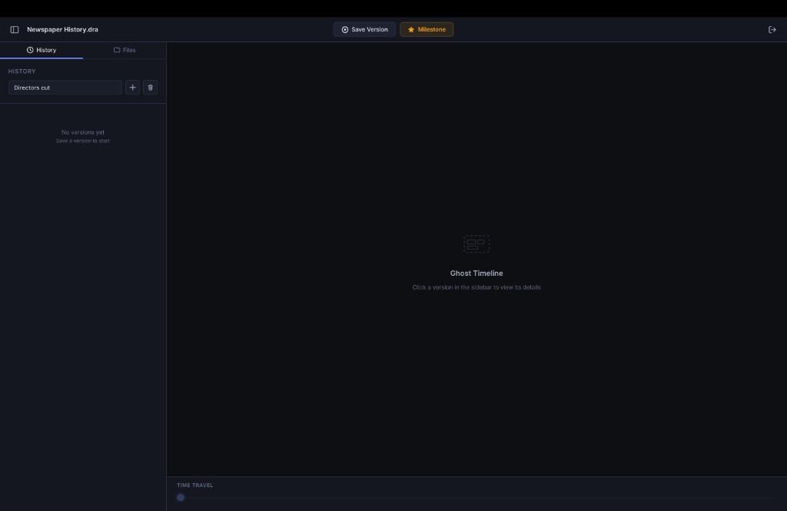
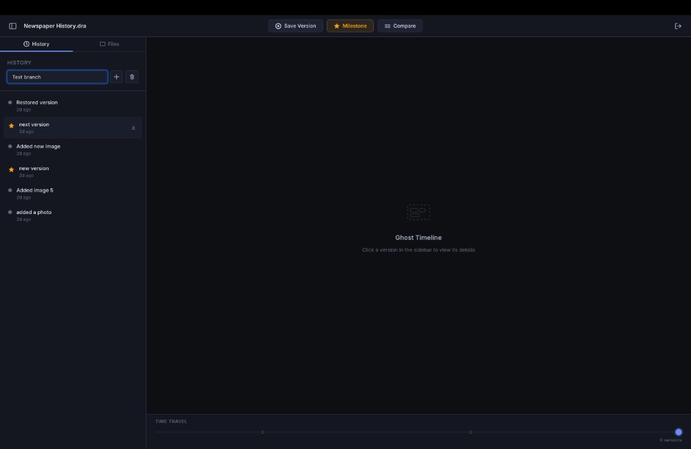
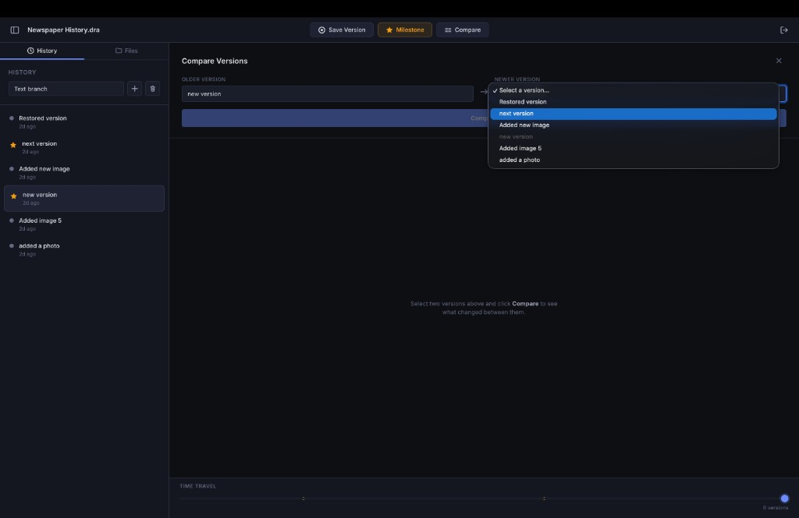
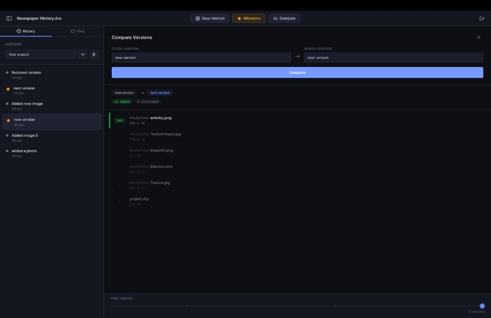

# Turn Around

**Version control for video. Commits, branches, and a time-travel slider through your project history.**

Turn Around is a desktop app that brings a Git-like workflow to video production. Stop juggling `Project_final_v3_really_FINAL.prproj` and guessing which timeline was the good one. Initialize a project, commit when it matters, branch to experiment, and scrub back through every version you’ve ever saved.

**Download:** [Latest release (macOS Apple Silicon)](https://github.com/khubaib-ctrl/TurnAround/releases/latest) — `.dmg` installer.

---

## Why this exists

Developers have Git. Video editors have … duplicate project files and hope. Turn Around fixes that: one place to track project files, timelines, and media, with real history you can browse and restore.

- **Commits** — Snapshot your project with a message (and optional milestone).
- **Branches** — Try a risky cut or alternate edit without touching the main timeline.
- **Time-travel slider** — Move through commit history and see what changed, when.
- **Timeline diffs** — Compare two versions side-by-side: tracks and clips, added/removed/modified.
- **Smart storage** — Content-addressable dedup so large media doesn’t duplicate. Small and project files are stored in full; big assets are hashed and referenced.
- **File watcher** — Edits are detected; you get a nudge to commit instead of forgetting.

Supports **OpenTimelineIO (OTIO)** and **Final Cut Pro XML (FCPXML)**. Your data stays on your machine. No cloud lock-in.

---

## Use cases & comparisons

### Turn Around vs traditional video workflows

| Traditional workflow | Turn Around |
|----------------------|-------------|
| Duplicate project files (`Project_v2.prproj`, `Project_FINAL.prproj`) | One project directory, many commits; history is first-class |
| Manual copies or external backups to “save” a state | Commit with a message; restore any version from the app |
| No way to try a risky edit without touching the main timeline | Branches: experiment, then merge or discard |
| “Which timeline had the good cut?” | Time-travel slider + timeline diff: see what changed, when |
| Large media duplicated for every backup | Content-addressable storage: same file = one copy |

### Turn Around vs Git

| Git | Turn Around |
|-----|-------------|
| Built for text (diffs, merges) | Built for video: project files, timelines, media |
| Binary blobs are opaque | Timeline-aware: parses OTIO/FCPXML, shows track/clip-level diffs |
| No notion of “timeline” or “sequence” | Commits capture project + timeline state; you compare edits, not raw bytes |
| CLI-first, branch/merge model | Desktop app: slider through history, visual diff, commit when you’re ready |
| Repo = one working tree | Same idea: one project dir, full history and branches inside the app |

Turn Around is “Git for video” in spirit (commits, branches, history) but designed for how video editors work: big assets, timeline structure, and a need to see what changed without reading source code.

---

## What it looks like

- **Dashboard** — All your Turn Around projects: open, rename, archive, see stats.
- **Workspace** — Timeline diff viewer (ghost timeline), history sidebar, commit dialog, branch list.
- **Compare mode** — Pick two commits and see track- and clip-level changes.

### Screenshots & demo

**Dashboard** — Project list, search, and quick actions (New Project, Open Folder). Filter by All / Active / Archived.



**Project card** — Open a project, see path, version count, branch count, disk usage, and last opened. Rename, archive, or delete from the card.



**Workspace — Ghost Timeline** — After opening a project, the main area shows the Ghost Timeline. Save versions or milestones; the sidebar lists branches and history. “Click a version in the sidebar to view its details.”



**Workspace — History** — Branch list and full version history with timestamps. Milestones are starred. Select a version to see it in the Ghost Timeline; use the time-travel slider at the bottom to move through history.



**Compare versions** — Choose two versions (older vs newer) and run a comparison to see what changed between them.



**Compare result** — File-level diff: added, removed, and unchanged files with sizes. Perfect for answering “what did I change between these two versions?”



A 30–60 second screen recording (GIF or MP4) of: open project → scrub the time-travel slider → open compare mode is still a great addition for LinkedIn and social.

---

## Tech

| Layer   | Stack |
|--------|--------|
| Frontend | Angular 21, TypeScript, RxJS |
| Backend  | Rust |
| Desktop  | Tauri 2 |
| Storage  | SQLite (per-project + global registry), content-addressable object store |

Rust handles VCS, timeline parsing, file watching, and backups. Angular handles the UI. Tauri wires them into a single native app.

---

## Get started

**Prerequisites:** Node.js (v18+), Rust toolchain, pnpm/npm.

```bash
git clone https://github.com/your-username/TrunAround.git
cd TrunAround
npm install
npm run tauri dev
```

**First run:** Open the app → “New project” or “Open folder” → choose a directory (or create one). Turn Around initializes its project data there (versions, metadata, and object store live in a hidden folder in that directory). Add your project files and media, then use the workspace to commit, branch, and browse history.

**Build for production:**

```bash
npm run tauri build
```

Binaries land in `src-tauri/target/release/`.

---

## Releases & packaging

**Download the latest build:** [GitHub Releases](https://github.com/khubaib-ctrl/TurnAround/releases/latest) — macOS (Apple Silicon) `.dmg`.

Stable releases (installers and binaries) make it easier for non-developers to try Turn Around without building from source.

**Build installers (per platform):**

```bash
npm run tauri build
```

Tauri produces native installers in `src-tauri/target/release/bundle/`:

- **macOS** — `.dmg` and/or `.app`
- **Windows** — `.msi` and/or `.exe`
- **Linux** — `.deb`, `.AppImage`, etc. (depending on Tauri bundle config)

**Publishing a release:**

1. Bump `version` in `src-tauri/tauri.conf.json` (and optionally `package.json`).
2. Run `npm run tauri build` on the target OS (or use CI for multiple platforms).
3. Upload the artifacts from `src-tauri/target/release/bundle/` to a **GitHub Release** (or similar): tag the release (e.g. `v0.2.0`), attach the installers, add short release notes.
4. Optionally add a “Releases” or “Download” link in the README that points to the latest GitHub Release.

As the project grows, consider GitHub Actions (or similar) to build macOS, Windows, and Linux installers on every tag and attach them to the release automatically.

---

## License

MIT. See [LICENSE](LICENSE). Use it, fork it, ship it.

---

## Contributing

Issues and PRs welcome. If you’re into timeline formats (OTIO, FCPXML, AAF, etc.), parsers and diff improvements are high-impact. Check open issues or open one with a use case.

---

*Turn Around — so you can go back.*
